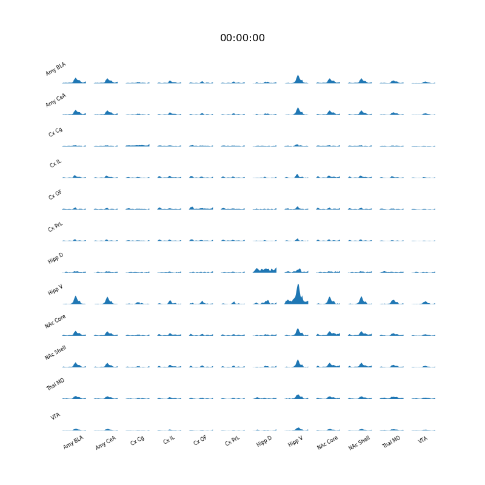

<h1 align="center">LPNE feature extraction and classification pipeline</h1>

<h3 align="center">Code for preprocessing and building models with local field potentials</h3>


<p align="center">

</p>

See `script.py` for usage.

#### Installation

```bash
$ git clone https://github.com/carlson-lab/lpne.git
$ cd lpne
$ pip install .
$ pytest test # run tests
$ cd docs
$ make html # build docs
```

Then see `docs/build/html/index.html` for the docs.

#### Dependencies
* [Python3](https://www.python.org/) (3.7+)
* [PyTorch](https://pytorch.org) 1.11+
* [MoviePy](https://github.com/Zulko/moviepy) (optional)


### TO DO
9. Add a Tucker decomposition model
10. PoE?
21. Make some pre-zipped features and labels: make TST public
31. Movie app
34. mouse-specific intercepts
36. SMC for sampling label sequence posterior
37. Mouse-specific normalization options
42. Early stopping in `GridSearchCV`
43. ``[b,f,r,r]`` vs ``[b,r,r,f]`` shapes
45. automatic groups?
47. More agressive normalization options
48. Add strict channel map checking options
49. Add CSV version of CHANS files
50. save `GridSearchCV` with validation scores for each parameter setting
52. Also save confusion matrices for ``GridSearchCV``
55. Add `__all__` to files
56. Add more `model.score` options
59. Make pipeline app
60. Fix the docs bugs
61. Make segments files with onset, offset, and label